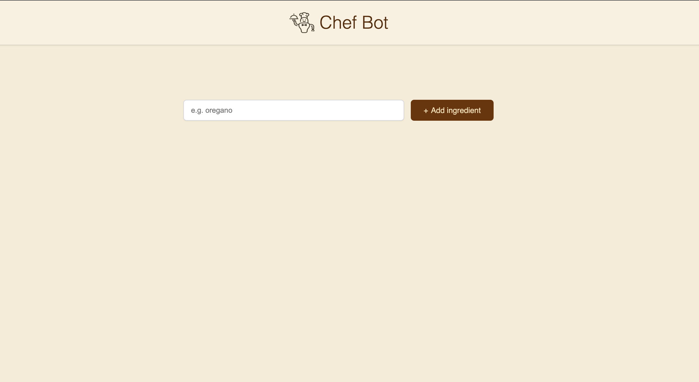

# 👨‍🍳 Chef Bot

Chef Bot is an AI-powered recipe assistant that helps you discover, generate, and manage delicious meal ideas in seconds. Just type in your ingredients or craving, and Chef Bot will whip up a recipe for you — fast, fun, and fuss-free!

 (./public/ingredients.png) (./public/recipe.png)

---

## 🧠 About the Project

Chef Bot is a modern web app inspired by Scrimba’s **Chef Claud** project, re-imagined with my own custom styling and features.  
It’s built to practice **React**, **Vite**, and **OpenAI API integration**, while exploring how to connect AI with a simple, engaging UI.

---

## ✨ Features

- 🧑‍🍳 AI-generated recipes based on user input
- 🥗 Ingredient-aware suggestions
- 💬 Interactive and responsive UI
- 🔄 Prevents multiple API calls using button disable logic
- 🌙 Light / dark theme toggle _(optional if you add it)_
- 📱 Responsive design — works great on mobile and desktop

---

## 🧰 Tech Stack

| Tool                   | Purpose                                     |
| ---------------------- | ------------------------------------------- |
| **React + Vite**       | Frontend framework and build tool           |
| **OpenAI API**         | Generates creative recipes and descriptions |
| **CSS / Tailwind CSS** | Styling and layout                          |
| **JavaScript (ES6+)**  | Core logic and interactivity                |

---

## ⚙️ Getting Started

### 1️⃣ Clone the Repository

```bash
git clone https://github.com/yourusername/chef-bot.git
cd chef-bot
```
